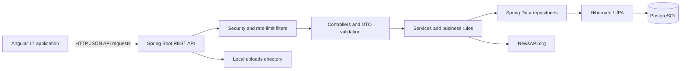

# TheTechWire

TheTechWire (WireBlog) is a full-stack publishing platform for writers and readers to discover stories, follow topic Trails, and keep useful community discussions together.

## Project documentation

- [Backend guide](backend/README.md): API layers, endpoints, configuration, and backend commands.
- [Frontend guide](frontend/README.md): routes, client architecture, configuration, and frontend commands.
- [Launch-readiness review](LAUNCH_READINESS.md): smoke-test results, launch blockers, and a value-focused product roadmap.

## Architecture



The backend follows a controller → service → repository structure. The frontend uses lazy-loaded Angular feature routes; core services call the API through `HttpClient`, and an interceptor attaches the stored JWT. The backend remains the authority for authorization—frontend guards are only for navigation and user experience.

## Repository layout

```text
blogapp/
├── backend/       Spring Boot 3.3 / Java 17 REST API
├── frontend/      Angular 17 standalone client
├── data/          Ignored local database/runtime data; do not commit or delete user data
└── README.md      Project overview and architecture
```

## Capabilities

- Registration, login, and JWT sessions. Email verification and password reset are intentionally disabled until an email provider is introduced.
- Public stories with source links, drafts, publishing, archive, search, tags, pagination, and author ownership.
- Story Trails that collect related posts into public topic pages.
- Public group discovery and readable discussions, with public follow or private request-to-join/invite-only membership.
- Group topic tags, purposes, rules, Story Trail links, threaded comments, and admin-reviewed join requests.
- Threaded story comments, comment flags, sharing, notifications, and Reader Pulse votes.
- NewsAPI headline fetching and local headline caching.
- Admin tools for users, posts, flagged comments, and sponsorship placements.
- Authenticated image uploads with type/signature checks, currently stored on local disk.

## Run locally

Requirements: Java 17, Maven, Node.js/npm compatible with Angular 17, and PostgreSQL.

1. Create a PostgreSQL database named `wireblog`. By default, `backend/src/main/resources/application.yml` uses `localhost:5432`, username `postgres`, and password `root`; adjust these local development settings or supply Spring datasource environment overrides if your database differs.
2. Start the backend from PowerShell:

	```powershell
	cd backend
	$env:NEWS_API_KEY="your_key_here" # optional; enables live headlines
	mvn spring-boot:run
	```

	The API listens at `http://localhost:8080`.
3. In another terminal, start the frontend:

	```powershell
	cd frontend
	npm ci
	npm start
	```

	The app listens at `http://localhost:4200` and uses `http://localhost:8080/api` in development.

See the [backend guide](backend/README.md#configuration) for production variables and the [frontend guide](frontend/README.md#configuration) for API URL settings.

## API overview

All API routes are under `/api`. Main resources include `/auth`, `/users`, `/posts`, `/comments`, `/groups`, `/friends`, `/trails`, `/pulses`, `/news`, `/notifications`, `/upload`, `/sponsorships`, and `/admin`. See the backend guide for the route inventory and access notes.

## Admin bootstrap

Register an account, then promote it in PostgreSQL:

```sql
UPDATE users SET role = 'ADMIN' WHERE email = 'you@example.com';
```

Log out and back in so the next JWT contains the updated role.

## Product direction and current limitations

WireBlog is the lasting, searchable home for story discussion; WhatsApp and other chat apps remain useful invitation and sharing channels. Group privacy, discovery, following, and private join requests are implemented. URL metadata preview cards, saved stories, Trail follows, personalized onboarding, and activity digests remain future work.

This is a development baseline, not a production-hardened deployment. Production secrets and deployment settings, durable media storage, shared rate limiting, session safety, and observability still need attention. The backend guide documents migration, configuration, and the current API workflow test coverage.

## Build and test

- Backend: `cd backend; mvn test` (runs API workflow tests for reader/author, group/friend, and administrator journeys using an isolated H2 database).
- Frontend: `cd frontend; npm run build` (there is no configured frontend test or lint script yet).
